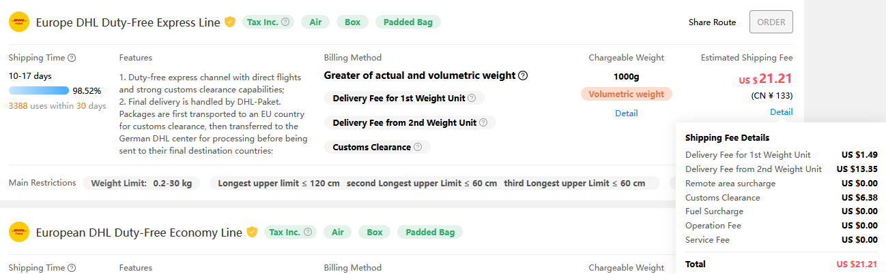
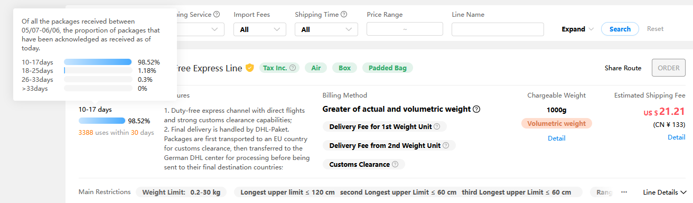

This is a short guide on how to oder on Superbuy! E.g. for odering the 60AIM40F Motor.
### What is Superbuy?
Do not be alarmed by it's sketchy looks! Superbuy is not a shop! Superbuy is a chinese forward shipping service. This means they will order a local product for you, inspect it and then send it to you. There are also quite a few services you can order with that as well, if you want them. That means you can buy at places like taobao relatively hassle free, and get local support on the actual items, before they get shipped to you. Roughly, the general process goes like this:
1. Order a product
2. Inspect wether everythign is fine or not. Send products back or let them get replaced accordingly.
3. Get the product shipped to you.

### Example
On the example of the 60AIM40F, let me show you the detailed steps!
1. You will need a Superbuy account to order. Register or log in!
2. Open the product you want to order, either by placing the link from the original shop (e.g. Taobao) into the  product Bar right at the top, or by opening a link, such as the one to the [60AIM40F](https://www.superbuy.com/en/page/buy/?url=https://item.taobao.com/item.htm?id=668578585661).
3. Select the options you want and add the product to cart.
4. Repeat with any other items you might want.
5. Go to your cart and select the products you want to order by checking the box on the left of them. Click "Submit"
6. On the next screen things might get a little unknown. Start by selecting the country the item will ultimately be shipped to, so where you live, at hte top. Then it is time to select inspection and service options. All of them are optional, and I rarely use them. I jsut leave everything as is usually.
7. When you are done slecting options, again, press "Submit".
8. Complete payment. Once payment is processed, the product will now get ordered by superbuy staff for you. You can check the orders status in your orders tab. You can find that by clicking on your profile, then on the left, select "My Orders".
9. Sometimes, prices change between the time you place the order and the superbuy staff orders the product. In that case, you will either have to pay the additional cost when you get notified or cancel the order.
10. Once your product is there, you can inspect it. To do that, open the pictures linked in your orders tab. If everything looks fine, you can continue. You can also order soem additional services liek extra photos with instructions if you are not sure. If you find a defect, you can send the item back or get a replacement.
11. If everything is fine, on the left, go to the "My warehouse" tab. here you can see all of your items ready for shipping. Select the ones you want to ship, and continue.
12. You cna either select the expert shipping service, where someone will try to find a good cheap shipping option for you, or you can do it yourself. I myself have always done it myself and can't speak on the quality of the exoert shipping service.
13. Shipping price is calculated by weight and measurements of the product. To see the details of the automatically calculated price, hover over "Detail"

You can also hover over the question marks in the middle to see more info on how the price is calculated relative to weight and measurements.
Another important thing is of course the shipping time. Superbuy has a confirmation button for when you have received your item. With that, it keeps a statistic on shipping time for each service. You can see that statistic by hovering over the days number, in the screenshot below "10-17 days":

This is a neat tool to see when you are likely to get your package!
I usually select one of the cheaper or the cheapest option. So far I have shipped with Yun Express, EUB, and EMS. All work great, though I have like Yun Express the most so far. They have been the quickest.
14. After you have selected your shipping service, you will now have to declare the tax value. Just put in the value you paid for the product when ordering from superbuy. You **can** theoretically put in any value you want, but I am not goingto elaborate on the risks of doing that (Tax fraud).
15. Finish up by confirming the parcel order! You can review the parcels status by going to the "My parcels" tab in your profile.
16. Happy shopping!