# Tools and Parts
This document gives and overview off all the parts, Hardware and Tools you need.

## 3D Printed Parts
These parts all need to be printed once! The files can be found [here](/../Hardware/3D%20printed%20parts/HG20/), both.stl and .3mf.
#### Print Settings:
Generally, the .3mf files contain the settings I print with, which are my recommended settings. However, each printer setup, print profiles and material is different, so please check and adjust settings and profiles accordingly. The .3mf files are optimized for eSun PLA Basic. In the following there are the core guidelines on what to pay attention to!
1. **Orientation:** Ignore the .stl orientations. Refer to the .3mf orientations instead. Do not reinvent the wheel. The orientations are crucial for the designs strength. The parts **will** break in the wrong orientation.
2. **Strength:** Most parts should be printed with at least 6 walls and 20% gyroid/cubic/similar infill. Adjust as needed depending on what material you print. Check the .3mf files to see which ones need less.
3. **Supports:** Due to the complexity of the design, many parts need supports. Please refer to the .3mf files for recommended support stucture. Some .3mf files have painted supports as well, for optimal printing.
4. **Layer Height:** Basically all prints are made for 0.2mm layer height and print well with it. The End Effector benefits strongly form adjsuting to 0.12mm or even 0.8mm layer height for a higher quality thread and overhangs. Many parts also benefit from variable layer height. Again, see the .3mf files to see if it is recommended on a part.
5. **Nozzle Size:** I have only ever printed with a 0.4mm nozzle, and therefore all my prints work well with that!
### Capstan Drum 
| Preview | File | Preview | File |
|---------|------|---------|------|
| 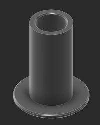 | `CapstanDrum_Main.stl` | 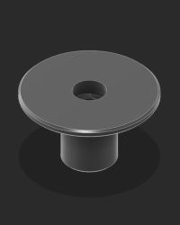 | `CapstanDrum_Top.stl` |

### Motor Head
| Preview | File | Preview | File |
|---------|------|---------|------|
| 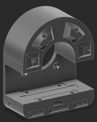 | `MotorHead_Back.stl` | 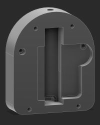 | `MotorHead_Front.stl` |
| 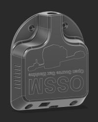 | `MotorHead_Cover.stl` | 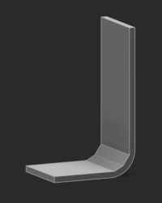 | `Standoff.stl` |
| 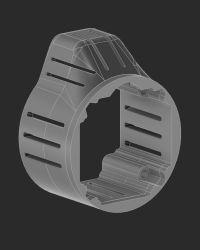 | `MotorCover_Main.stl` | 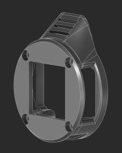 | `MotorHead_Front.stl` |
| 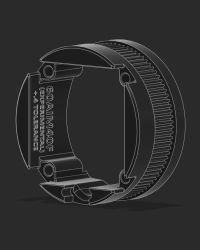 | `Pitclamp_MotorRing_60AIM40F.stl` |  |  |

### EndEffector
| Preview | File | Preview | File |
|---------|------|---------|------|
| 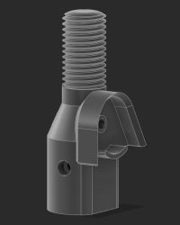 | `EndEffector_<Hole End Offset>mm.stl` | 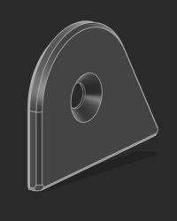 | `EndEffector_PulleyCover.stl` |

### Rail End
| Preview | File | Preview | File |
|---------|------|---------|------|
| 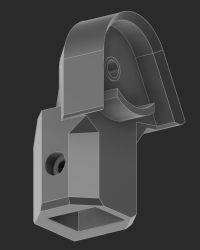 | `RailEnd_<Hole End Offset>mm.stl` | 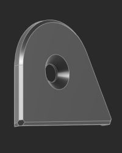 | `RailEnd_PulleyCover.stl` |

### Tensioner
| Preview | File | Preview | File |
|---------|------|---------|------|
| 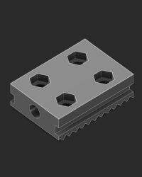 | `Tensioner_Bottom.stl` | 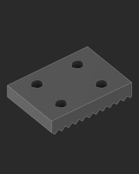 | `Tensioner_Top.stl` |

 

## Bill of Materials
The sourcing is mainly done for Gemrany, where I am based. Many linked parts ship worldwide or within Europe as well. You will need to look for your own sources, for your region if the provided sources don't work for you. Prices are rough estimates, with EU VAT, but without any additional costs attached (like the stupid new 3€/category from china imports).

**Rope:** The rope listed below can be quite hard to get depending on your region. There is a shop that claims worldwide whipping on the rope I develop the machine for, but users have reported theird orders getting canceled. You can still try it, it's still listed. I do not have the time and ressources to try lots of different ropes for every region. You have two options:
   1. Ask someone to ship it to you (Forwarding)
   2. Source a rope yourself and test it yourself. The important part here is that the rope is made out of Dyneema. Best case is Dyneema DM20, but Sk99 and SK78 work great as well. The Liros DC Pro 161 is made out of Dyneema Sk99. **Do not buy cheap aliexpress UHWMPE**. Testing has found that it is absolute crap that creeps ands stretches by unholy amounts. The second important part is that it is around 1mm in diameter, and this is where things get a bit harder most of the time. I wouldn't recommend going over 1.1-1.3mm. Thicker diameters may take away too much space on the drum, but feel free to test yourself. And if you do, pelase report!

| Part | Cost (incl. shipping & tax) | Link |
|------|-----------------------------|------|
| 60AIM40F (+485 single turn version) | ~110€ | https://www.superbuy.com/en/page/buy/?url=https://item.taobao.com/item.htm?id=668578585661    [How to order from Superbuy](https://github.com/SaladDressingHW/Salads-OSSM-Additions/blob/main/Salad's%20Beginner%20Guide%20to%20the%20'Ultimate'%20OSSM!/Superbuy.md)|
| RS485 to USB cable (for motor programming) | ~0€ | comes included with motor when bought from link above |
| OSSM Control Board + Remote (can buy board only if you want wireless remote) | 91 USD (excl. tax & shipping) | https://www.researchanddesire.com/products/ossm-reference-board |
| 2x 6 x 29.3 x 8 mm [id x od x w] U-Groove Pulley | ~8€ | https://de.aliexpress.com/item/1005007465275570.html |
| Fasteners & Nuts | ~30€ | see section below |
| 1kg PLA | ~10€\kg | use whatever works for you |
| 10m Dyneema DM20/SK99/SK78 Rope   Standard: Liros DC Pro 161   NA: New England Ropes HTS 99 | ~15€ | WW shipping: https://www.kitelineshop.com/ligne-liros-dcpro161-au-metre-c2x38222201    US: https://www.mapleleafropes.com/store/category/new-england-ropes-hts-99-1   Germany & EU: https://www.blackbox-sailing.de/products/liros-dc-pro-kiteleine   EU: https://workshop.boardway.org/Liros-DC-Pro-161_1 |
| Bushing 20x24x40 (id x od x l) | ~5€ | https://de.aliexpress.com/item/1005009236377507.html |
| HG20 Linear Rail + HGH20HA Carriage | ~40€ (depending on length) | HG20 400/500mm + Carriage: https://de.aliexpress.com/item/4001272098866.html   HG20 other lengths: https://de.aliexpress.com/item/1005007417885303.html |
| Epoxy glue | ~3€ | https://de.aliexpress.com/item/1005007115129874.html |
| 4 pin JST PH2.0 header cable 30cm | ~3€ | https://de.aliexpress.com/item/1005009087160808.html |
| 2 pin awg 18 or thicker 30cm | ~2€ | https://de.aliexpress.com/item/1005006614755156.html |
| 24mm id shrink tube | ~4€ | https://de.aliexpress.com/item/4000211463126.html |
| Heat Sink 40x40x20mm | ~7€ | https://de.aliexpress.com/item/1005007090772998.html |
| 36V 5+A power supply: Mean Well GST220A36-R7B + r7bf-p1j adaptor | ~68€ | GER: https://www.voelkner.de/products/2995507/MW-Mean-Well-GST220A36-R7B-Tischnetzteil-Festspannung-36-V-DC-6.1A-219.6W.html  **+**  https://www.voelkner.de/products/6716585/MW-Mean-Well-DC-PLUG-R7BF-P1J-Adapter.html   Look for your local distributors here: https://www.meanwell.com/distributors.aspx    Farnell, TME, Digikey and Rs-online ship to almost everywhere in the world! |
| Isopropyl Alcohol || local Hardware Store |
| **Total** | **~390€** | |

 

## Fasteners & Nuts
The table below lists all the dasteners and nuts you need and what it is used for.

| Screw  | Type                    | Amount | Usage                                                                                                                           |
|--------|-------------------------|--------|---------------------------------------------------------------------------------------------------------------------------------|
| M4x16  | Button Head                | 4      | Tensioner Rope Clamp                                                                                                            |
| M5x45  | Countersunk               | 2      | Attaching Motor Head Back to Motor                                                                                              |
| M5x80  | Countersunk               | 4      | Attaching Motor Head Cover to Motor Head                                                                                        |
| M6x25  | Countersunk               | 2      | Mounting U-Groove Pulley to End Effector and Rail End                                                                           |
| M3x12  | Hex Cap                 | 2      | Attaching the PCB to the Motor Head Cover                                                                                       |
| M5x20  | Hex Cap                 | 4      | Mounting HGH20HA Carriage to Motor Head Back                                                                                    |
| M5x30  | Hex Cap                 | 3      | 2x: Mounting End Effector and Rail End to HG20 Rail   1x: Securing Capstan Drum to Motor shaft                                                                                  |
| M5x65  | Hex Cap                 | 8      | 2x: Attaching Motor Head Back to Motor   2x: Attaching Motor Head Front to Motor Head Back   4x: Mounting Motor Cover to Motor Head |
| M5x110 | Hex Cap, [fully threaded](https://de.aliexpress.com/item/1005005879037174.html) | 1      | Rope Tensioner Screw                                                                                                            |
| M3     | Nuts                    | 2      | Attaching the PCB to the Motor Head Cover                                                                                       |
| M4     | Nuts                    | 4      | Rope Tensioner Clamp                                                                                                            |
| M5     | Nuts                    | 9      | 6x: Back of Motor Head Back   2x: End Effector and Rail End   1x: Rope Tensioner Clamp                                              |
| M6     | Nuts                    | 2      | End Effector and Rail End                                                                                                       |
| M5x20  | Coupling Nuts           | 4      | Coupling Motor Head to Motor Cover                                                                                              |

#### Standards:
- Button Head Screws: ISO 7380
- Countersunk Screws: ISO 10642
- Hex Cap: ISO 4762, except fully threaded M5x110
- Nuts: DIN 934, ISO 4033 should work

## Tools
You don't need much at all to build this machine! Very basic tools:
1. Screwdriver
2. Hex Bits sizes 2.5mm, 3mm & 4mm. I use this bitset: https://de.aliexpress.com/item/1005006233315642.html
3. Slotted Bit 2mm
4. Pliers
5. lint free cloth (e.g. glasses cleaning cloth)
6. household single use gloves
7. Heatgun/Hairdryer/Lighter