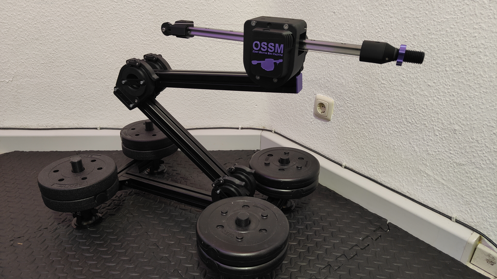

Hundreds of hours of work as well as a lot of monetary resources go into this project! If you like my work, consider supporting me on [Ko-Fi](https://ko-fi.com/deepfantasies)!

# Capstan OSSM XL

Revamp of the OSSM drive mechanism to use a capstan based version, enabling higher load use with a more powerful motor, namely the 60AIM40F.

A Capstan Drive is based on rope and a pulley. For a nice video explaining the mechanism, check this awesome video by Aaed Musa: [https://www.youtube.com/watch?v=MwIBTbumd1Q](https://www.youtube.com/watch?v=MwIBTbumd1Q "https://www.youtube.com/watch?v=MwIBTbumd1Q")

**Why Capstan?**

The belt driven Version has shown for myself and quite a few others limitations. At higher torques, it would sometimes slip. Bear in mind, it could be that is the result from build or other errors.

**Comparison to the standard OSSM**

Pro:

 - same form factor
 - as quiet or quieter
 - 16.5cm (e.g. 450mm rail -> 28.5cm stroke)
 - 2.7 times stronger (32kg compared to 12kg)
 - same speed
 - no slipping, reliable operation
 - PitClamp compatible
 - compatible with all custom end effectors

Con:

 - harder to build
 - bigger motor -> more expensive (~110€ shipped incl. tax to germany)
 - more to print
 - in extreme use cases there may be slipping of the rail over time, is fixed by rerunning homing
 - rope must always be tight -> regular checking
 - more heavy duty mounting recommended
 
The current iteration of the machine, that being the HG20 version, has been tested by me for many months now and has served all my needs. It also has been built and praised by many people in the KinkyMakers Discord Community.

Thread MGN12H: https://discord.com/channels/559409652425687041/1395456804464623817
Thread HG20: https://discord.com/channels/559409652425687041/1437149434143182959
# MGN12H vs HG20

**The MGN12H version is deprecated**

MGN12H rails and carriages get to their limit with 30cm+ cantilevers combined with heavy toys ~1.5kg and up. This results in louder operation, damaging of the bearings over time and deflection issues. So I recommend going with the HG20 Version if you plan to use big, heavy toys.
Additionally, the HG Version comes with a number of improvements such as a bigger drum and better rope guiding for even smoother operation.

I do consider the MGN12H version to be outdated so I do recommend going with HG20 if you can afford the +~40€ in cost.

# Rail Lengths
The Capstan Drum on the HG20 version was tested for 450mm. Shorter is always possible. 500mm and 550mm should be possible as well, but hasn't been tested by me (yet). Longer I do not recommend.

As for MGN12H, stay at 500mm or below.

# Rope
Use the rope I list (Liros DC pro 161). If you can't, try to source another dyneema dm20, sk99, sk75 max. diameter 1mm rope.

**DO NOT** use generic uhwmpe from aliexpress. Experiments from kind @neos have shown that the quality is shit. It stretches and breaks with load. It is essential that the rope stretches as little as possible. Lots of research has been done to find the correct rope. Stick to it. Or deviate at your own risk and cost.

# Printing
I have included .3mf file with configured settings. They require decent bridging performance. Some files don't have .3mf files. Those are quite straight forward to print. I always recommend 6 walls 20% infill.
# BOM
see /3D printed parts/MGN12H or /3D printed parts/HG20 respecively

Finally, special thanks to everyone that helped me and gave suggestions when I hit a wall!
