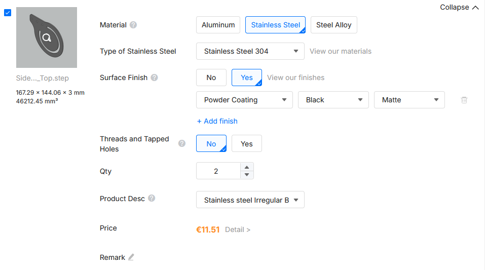
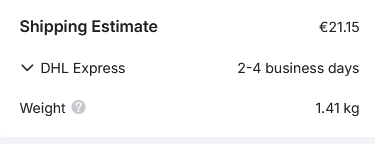
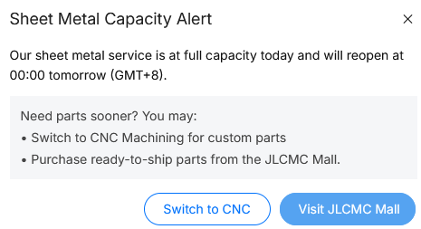

This short guide covers on how to order laser cut designs at JLCCNC, e.g. for the hinge for the [Shick's Mount Modernised]()!
1. Go to [JLCCNC's Website](https://jlccnc.com/)
2. Click on the big blue button "Get Isntant Quote" or in the top right "Order Now"
3. In the top row labeled "Select Product", scroll to the right and select "Sheet Metal"
4. Now upload the .step models provided in the repo by dropping them into the according field.
5. Select these settings:
   
   You can choose any surface finish you like, or none at all, according to your preference!
6. In the order summary on the right, look at the shipping. Open the shipping selection menu by clicking on the drop down arrow:
   
   Select the shipping according to your preferences. I usually go with EuroPacket, it's cheap.
7. Now press "Order"! Unfortunately you will need to create an account.
8. You may get a popup like this:
   
   Just come back at the stated time, in this case "tomorrow 00:00 GMT+8" and try to order again. Be on time for the best chances to get your order out. You may need a couple tries.
9. That's all! Enjoy!